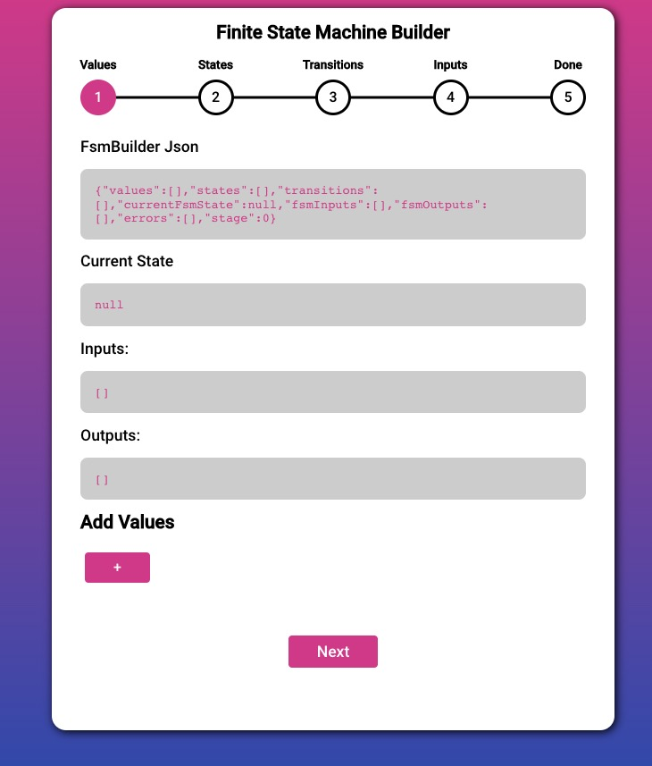
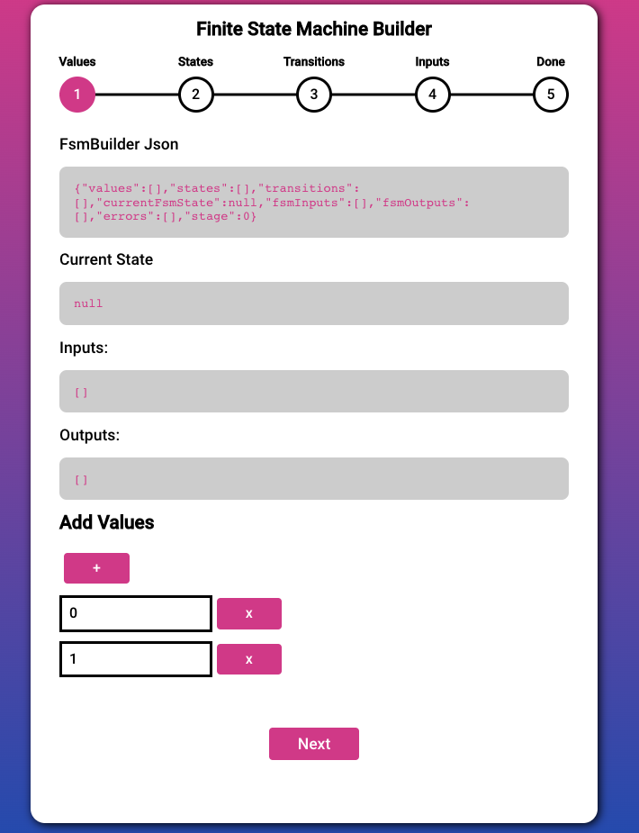
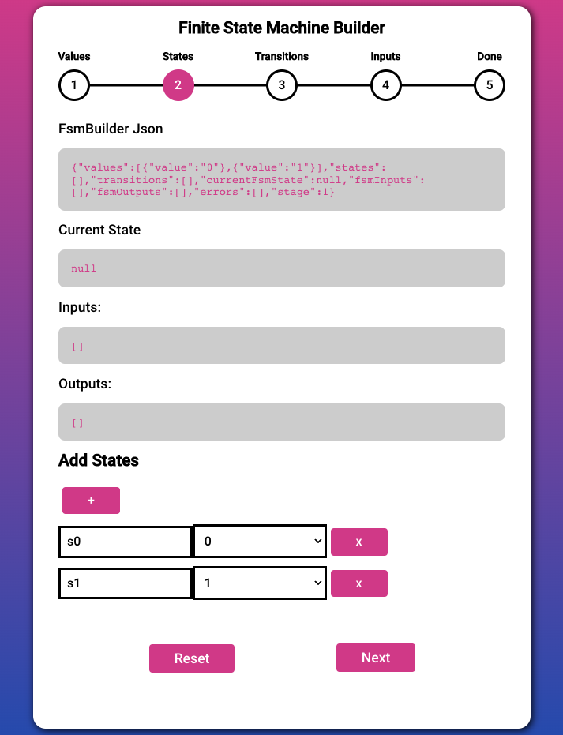
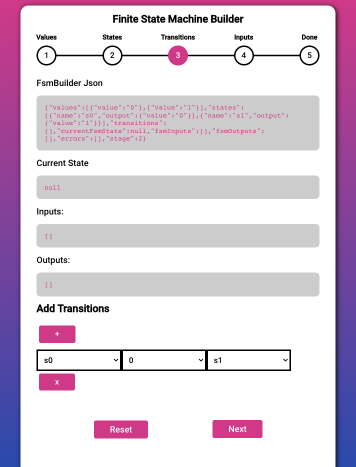
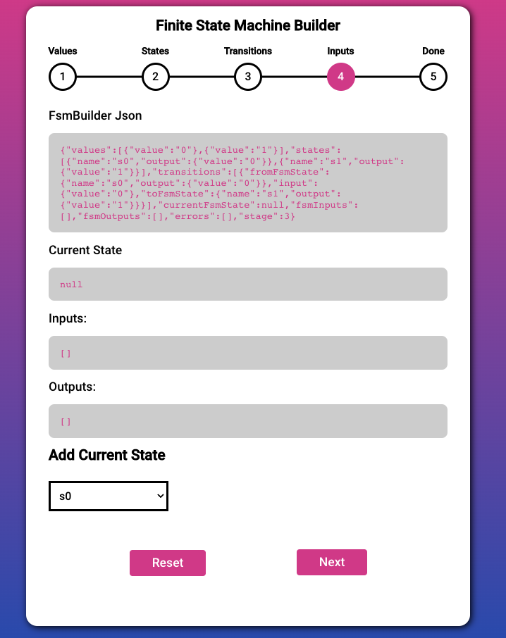
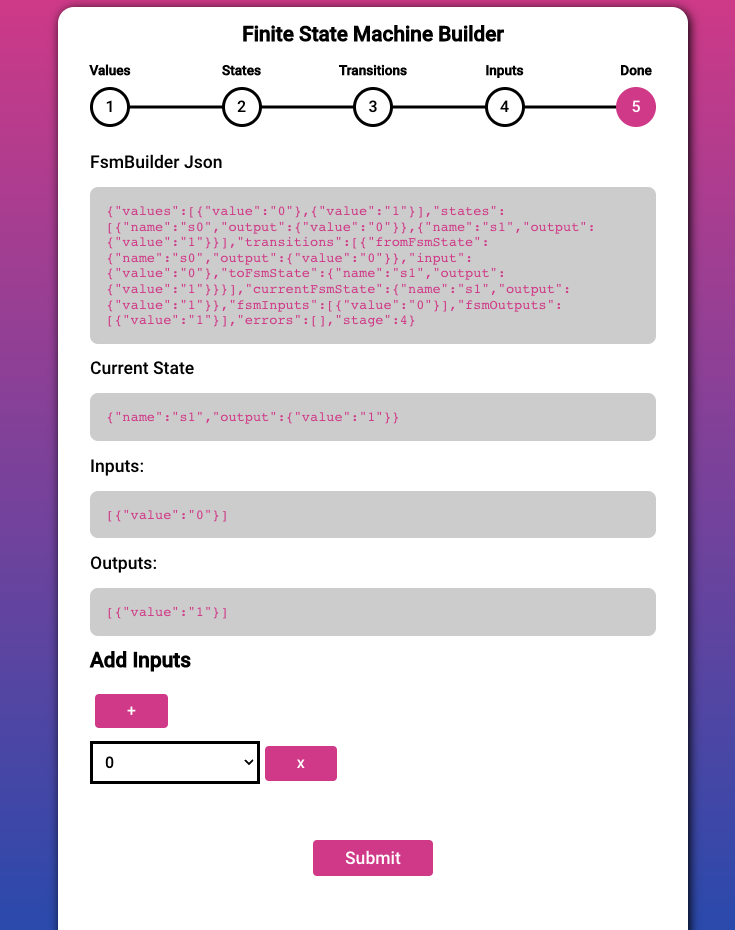
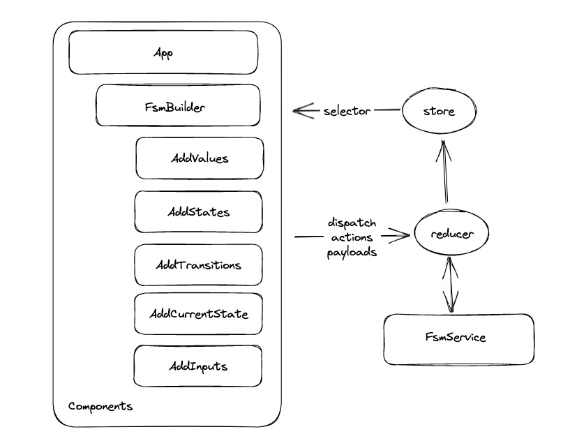
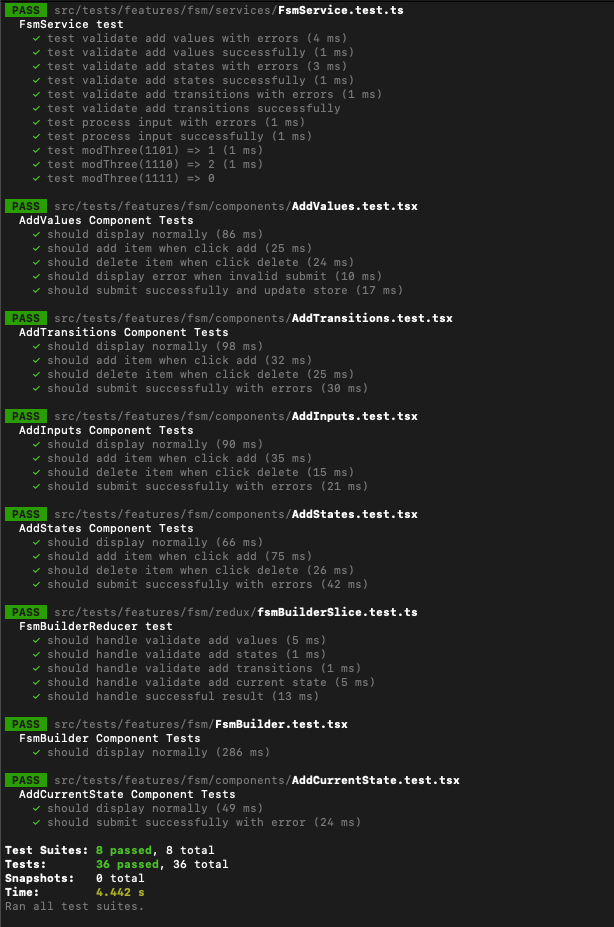

# Finite State Machine

## Table of Content
* [Overview](#overview)
* [Demo](#demo)
* [Technical Aspect](#technical-aspect)
    * [Design Diagram](#design-diagram)
    * [Tech Skills](#tech-skills)
    * [File Structure](#file-structure)
* [Tests](#tests)


## Overview
Create a React App for generating an FSM (Finite State Machine)

## Demo









### Installation and Executing Instruction
1. Require node 18+
2. Run `npm install` on project root
3. Under project directory `npm start`

### Design Diagram



### Tech Skills
- Typescript Programming
- React, Redux, Jest, Sass
- SOLID principle
- Unit Testing


### File Structure

- `/src` is the core library
- `/features` is the standalone components
- `/features/fsm` is the standalone fsm component
- `/features/fsm/assets` is fsm scss
- `/features/fsm/components/` is the fsm required components
- `/features/fsm/redux` is the reducer
- `/features/fsm/services` is fsm logic
- `/tests` includes all test suites

## Tests

The test suite uses Jest. All test files are under the `tests` folder.

To run the test suite

```zsh
npm test -- --verbose
```




